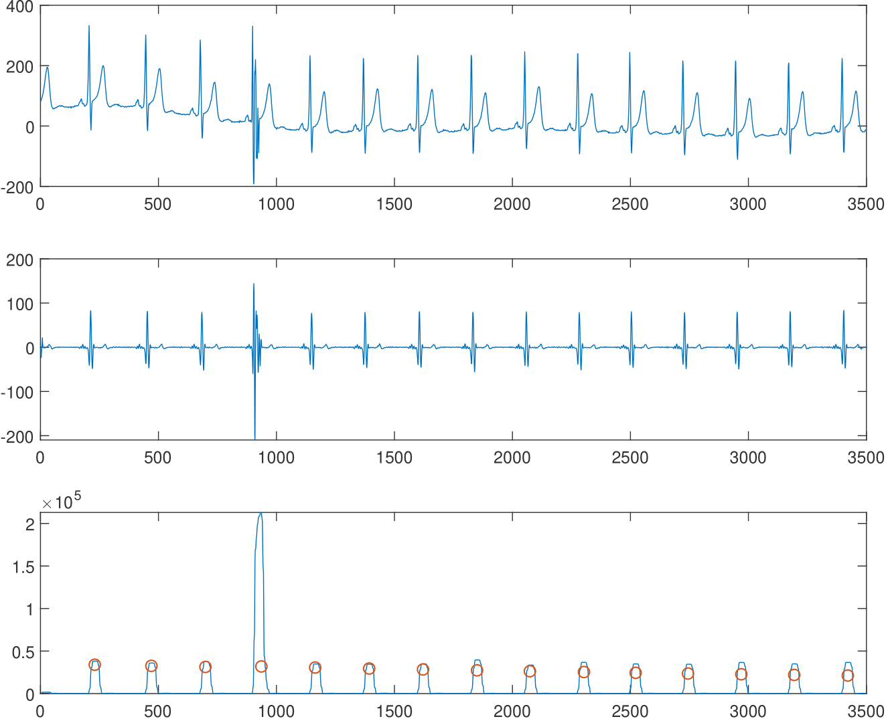
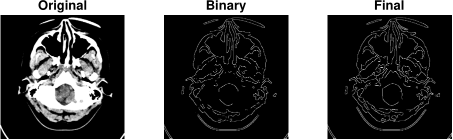

# Biomedical Data Processing
Two demo MATLAB implementations that use signal and image processing techniques to process Biomedical Data.
Part of the homework for the Biomedical Signal and Image Processing course at the University of Ljubljana, Faculty of Computer and Information Science. 

More detailed reports are available in the Slovenian language in the file "porocilo.pdf".

## Electrocardiogram Signal Analysis
Implementation of an algorithm that analyses ECG signals to detect QRS complex ("heartbeat") in real-time. 
Based on Chen and Chen's algorithm [1] with some additional improvements such as using multiple leads. 
It amplifies the QRS waveform frequencies and diminishes the rest by using a combination of filters. 
Afterwards, QRS complexes are marked by applying a decision-making process. 
The main steps of the analysis can be seen bellow - original ecg signal, filtering and marking the QRS:

<!---
Tested on the [MIT-BIH Arrhythmia](https://physionet.org/content/mitdb/1.0.0/) and [Long Term ST](https://physionet.org/content/ltstdb/1.0.0/) databases with the [wfdb package](https://archive.physionet.org/physiotools/wfdb.shtml). 
Achieves above 0.97 precision and sensitivity. A sample of the test data is included with the source code.
-->

## Canny Edge Detector for Computed Tomography Head Scans
Three variants of edge detection for CT scans:
* basic Canny edge detector [2]
* improved edge connection with the *One-component-at-a-time* approach, part of the Vincent et al. watershed segementation algorithm[3]. Optionally, morphological opening can be used but we do not recommend it for this specific use case as it can remove important edges. 
* improved edge connection with *Local processing* approach described in Gonzales et al. [4], with Morphological Boundary Extraction

The *One-component-at-a-time* approach proved to be most effective, the results of which can be seen below as the original CT scan, binary image of edges, and final results after edge linking: 

## Literature
[1] Chen, H.C., Chen, S.W.: A moving average based filtering system with its application to real-time qrs detection. In: Computers in Cardiology, 2003. pp. 585–588(Sep 2003)

[2] Canny, J.: A computational approach to edge detection. IEEE Transactions on Pattern Analysis and Machine Intelligence PAMI-8(6), 679–698 (Nov 1986)

[3] Vincent, L., Soille, P.: Watersheds in digital spaces: an efficient algorithm based on immersion simulations. IEEE Transactions on Pattern Analysis and Machine Intelligence 13(6), 583–598 (June 1991

[4] Gonzalez, R.C., Woods, R.E.: Digital image processing. Prentice Hall, Upper Saddle River, N.J. (2008)
